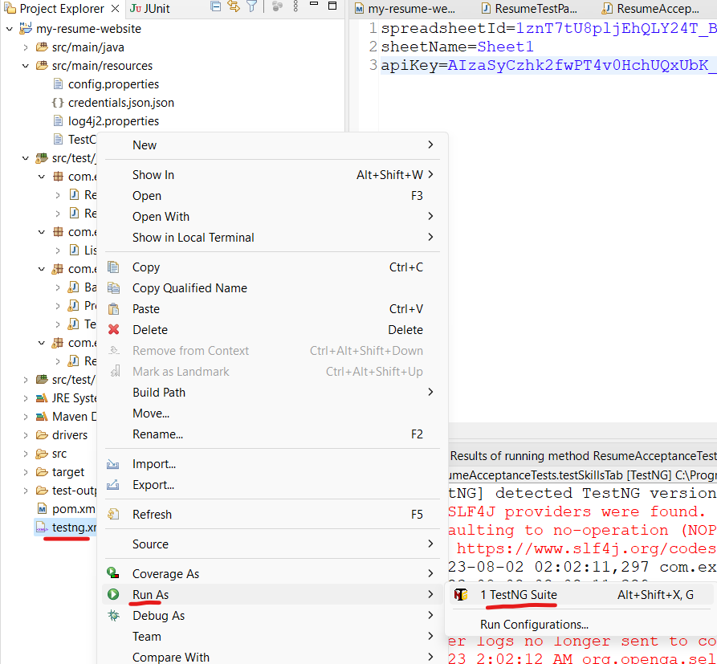
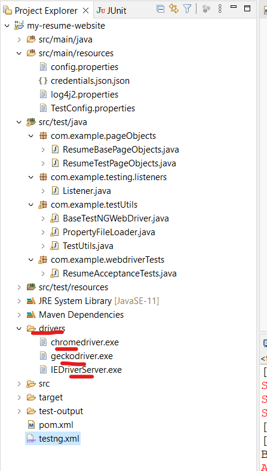
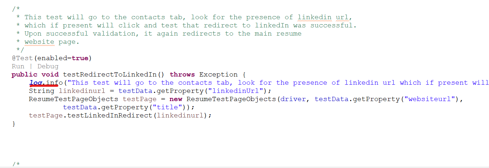

# Project Name

Resume website automation with Selenium Java and TestNG 

## Description

Front-end automation to cover happy path and negative scenarios of a Resume website running on "https://jrasi20.github.io" 

## Table of Contents

- [Running tests](#Runningtests)
- [Settings](#settings)
- [Usage](#Usage)
- [Features](#features)
- [Contact](#contact)
- [Testcases and Report](#testcasesandreports)

## Running tests

Git clone https://github.com/jrasi20/my-resume-website.git master branch. Either import java project into Intellij or Eclipse IDEs or run them as maven or testng from command line

* To import into IDE, Open IDE, and import the POM file.
* To run as Maven tests from command line, go to the project directory where the .pom file exists, and enter "-mvn clean install"
* This can also be run by right clicking on the testng.xml in the project root, Run as > TestNG suite

All the dependencies needed to execute tests are included in the project

## Settings

* Tests can be run on 4 different browsers including chrome, firefox, IE, Safari. All browsers except safari (for mac os) need drivers compatible with the browser version run.
* These drivers have been added within the project itself:

--geckofriver.exe for Firefox
--chromedriver.exe for chrome 
--IEDriverServer.exe for Internet explorer

> Prior to Safari automation, enable the Remote Automation feature from the developer menu. To do so, enable the Safari Developer menu first with the steps below:

a.Go to Safari -> Preferences-> Advanced
b.Tick mark the Checkbox with the label – Show Develop menu in menu bar.
c.Once done, go to the Develop menu and click on the Allow Remote Automation option to enable it.

Once this is done, users can straightaway get started with the programming part without downloading Safari WebDriver.

## Usage

Go to /src/main/resources/TestConfig.properties to choose which browser to run test automation against. 

#Define browser for running Selenium tests across different browsers
#selenium.browser=firefox
selenium.browser=chrome
#selenium.browser=iexplore
#selenium.browser=safari

Here, I have set it to run on chrome. Likewise you can make the automation run on any browser from the list.

PS: If tests don't run on your browser it could be because the driver was not compatible with the browser version you are running on

## Features

The tests reside at com.example.webdriverTests.ResumeAcceptanceTests.java. Logger and Listeners have been implemented to show whcih test case is running and their corresponding status(pass/fail). Logger class also gives a brief description about the test case scenario that is running.

## Contact

You can contact me at "janerasika20@gmail.com" if you have any questions

## Test cases and Report

Test cases and report are stored in /Test cases and report/Jane's test case template.xlsx
Sheet1-Test cases
Sheet2-Automation results from latest run HTML REPORT
Sheet3- Jenkins console report

## Jenkins credentials
username-janeras
password-NewP@ssw0rd@123
Job name-My-Resume-Project
